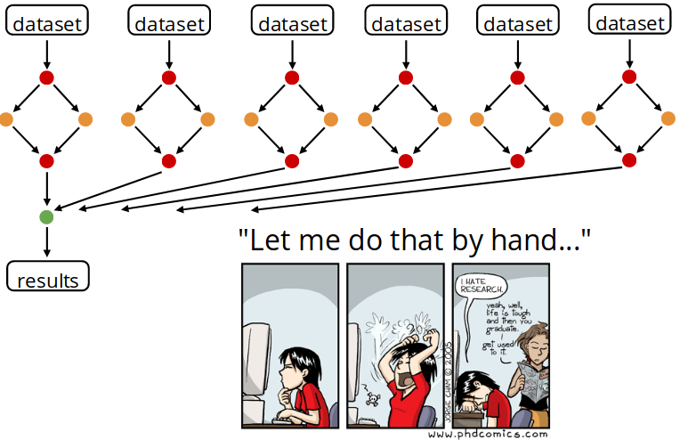

Introduction
===



# Why Snakemake? 

- **A common pattern in scientific computing involves the execution of many computational or data manipulation tasks. Those tasks are usually coupled, i.e., data produced by of one task are consumed by one or more other tasks. Thus execution of such tasks often requires a non-trivial coordination (orchestration) to satisfy their data dependencies.**

**[Snakemake](https://snakemake.readthedocs.io/en/stable/index.html) is a workflow management system that helps you build pipelines between the scripts of your project.**

> Snakemake [slides](http://slides.com/johanneskoester/snakemake-tutorial#/)

- Snakemake allows you to create a set of rules, each one defining a "step" of your analysis. Rules can either use shell commands, plain Python code or external Python or R scripts to create output files from input files[^smake_paper].

[^smake_paper]: https://academic.oup.com/bioinformatics/article/28/19/2520/290322

**The workflow is implied by dependencies between the rules that arise from one rule needing an output file of another as an input file.**

For each rule you need to provide:

+ **Input** : Data files, scripts, executables or any other files.

+ **Expected output**. It's not required to list all possible outputs. Just those that you want to monitor or that are used by a subsequent step as inputs.

+ A **command** to run to process the input and create the output.

```
rule myname:
    input: ['myinput1', 'myinput2']
    output: ['myoutput']
    shell: 'Some command to go from in to out'
```

### Snakemake Advantages:

+ Memory: stores the architecture of the work and allows you to rapidly perform a complete or partial analysis.

+ Portability: if built in a user-sensitive way, anyone working on the same analysis can obtain every results.

+ Modularity: as a rule is only a path between an input and an output, if one method or technique used in the analysis needs to be updated or modified, it can be replaced by a new rule with the same output. It allows a parallel comparison of different techniques in a very simple way.

+ Reproducibility: if you’re analysing a data sample collected by the same experiment in different years of exploitation and you plan to analyse data samples not even collected yet, Snakemake is a simple solution to perform the same analysis to different data sets.

+ **Snakemake workflows can be easily executed on workstations, clusters, the grid, and in the cloud without modification**. The job scheduling can be constrained by arbitrary resources like e.g. available CPU cores, memory or GPUs.

+ **Snakemake can automatically deploy required software dependencies of a workflow using Conda or Singularity.**

+ Snakemake can use Amazon S3, Google Storage, Dropbox, FTP, WebDAV, SFTP and iRODS to access input or output files and further access input files via HTTP and HTTPS.

# Why Containers?

![]

Container

:	A container image is an encapsulated, portable environment that is created to distribute a scientific analysis or a general function. Containers help with reproducibility of such content as they nicely package software and data dependencies, along with libraries that are needed.

- Hubs hosts over 100,000 pre-built, ready-to-use containers

- examples of things you can do with containers:
	+ Package an analysis pipeline so that it runs on your laptop, in the cloud, and in a high performance computing (HPC) environment to produce the same result.
    + Publish a paper and include a link to a container with all of the data and software that you used so that others can easily reproduce your results.
    + Install and run an application that requires a complicated stack of dependencies with a few keystrokes.
    + Create a pipeline or complex workflow where each individual program is meant to run on a different operating system.


- [Singularity Slides](https://docs.google.com/presentation/d/14-iKKUpGJC_1qpVFVUyUaitc8xFSw9Rp3v_UE9IGgjM/pub?start=false&loop=false&delayms=3000&slide=id.g1c1cec989b_0_154)