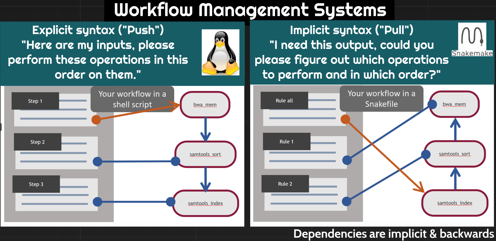
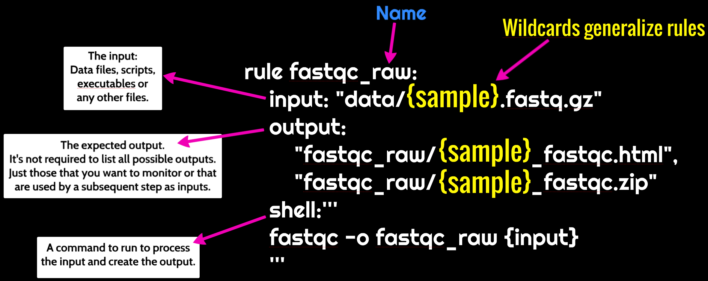
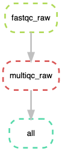
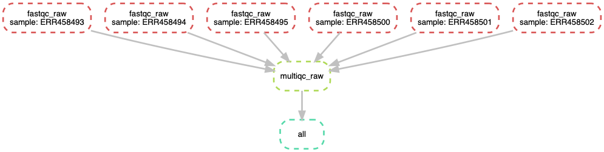

# Workflow Management using Snakemake

## Learning Objectives

+ Identify cases where workflow managers are helpful for automation
+ Understand the components of a Snakefile: rules, inputs, outputs, and actions.
+ Write and run a Snakefile
+ Learn about using isolated conda environments in rules
+ Learn to use docker/singularity containers in Snakemake rules

> See here for CyVerse [**Guide to Launching Atmosphere Instances**](https://snakemake2019.readthedocs.io/en/latest/Atmosphere_Cloud.html)

## Setup

1. Login to CyVerse [Atmosphere](https://atmo.cyverse.org/application/images) and launch a medium ‘m1’ instance with the ‘Snakemake2019’ v1.0 base image

2. Open Rstudio

- Type the following in your terminal to display a link to Rstudio web-server for your instance's $(hostname)

```
echo http://$(hostname -i):8787/
```
- click on the link generated to open Rstudio in your browser and login with your CyVerse credentials.

<center></center>
<br>

3. Activate Conda

```
echo export PATH=$PATH:/opt/miniconda3/bin >> ~/.bashrc
```

4. Then, run the following command (or start a new terminal session) in order to activate the conda environment:

```
source ~/.bashrc
```

5. Try running the following UNIX command 'which', which returns the pathnames of the files (or links) which would be executed in the current environment:

```
which snakemake
```
> it should show the absolute path of snakemake as '/opt/miniconda3/bin/snakemake'

6. Check if singularity is available in your $PATH and print version:

```
which singularity
```
> It should show the absolute path of singularity '/usr/local/bin/singularity'


- **We will be executing the same workflow [fastqc](https://www.bioinformatics.babraham.ac.uk/projects/fastqc/)--->[multiqc]()--->[trimmomatic]() as in [Basic Tutorial](https://snakemake2019.readthedocs.io/en/latest/smake_basic_tutorial.html) but, with tools being executed in singularity containers based on either Docker or Singularity builds**

7. Download data

```
mkdir data
cd data/
curl -L https://osf.io/5daup/download -o ERR458493.fastq.gz
curl -L https://osf.io/8rvh5/download -o ERR458494.fastq.gz
curl -L https://osf.io/2wvn3/download -o ERR458495.fastq.gz
curl -L https://osf.io/xju4a/download -o ERR458500.fastq.gz
curl -L https://osf.io/nmqe6/download -o ERR458501.fastq.gz
curl -L https://osf.io/qfsze/download -o ERR458502.fastq.gz
```

## Introduction to Snakemake

The Snakemake workflow management system is a tool to create reproducible and
scalable data analyses. It orchestrates and keeps track of all the different
steps of workflows that have been run so you don't have to! It has a lot of
wonderful features that can be invoked for different applications, making it
very flexible while maintaining human interpretability.  

There are many different tools that researchers use to automate computational
workflows. We selected snakemake for the following reasons:

+ It’s free, open-source, and conda-installable
+ Snakemake works cross-platform (Windows, MacOS, Linux) and is compatible with
all HPC schedulers. It works on laptops, the cloud, and clusters without
modification to the main workflow (as long as you have enough compute
resources!).
+ Snakemake is written using Python, but supports bash and R code as well.
+ Anything that you can do in Python, you can do with Snakemake (since you can
pretty much execute arbitrary Python code anywhere).

Like other workflow management systems, Snakemake allows you to:

+ Keep a record of how your scripts are used and what their input dependencies
are
+ Run multiple steps in sequence, parallelizing where possible
+ Automatically detect if something changes and then reprocess data if needed

Our goal is to automate the first two steps (FastQC MultiQC) of our example
workflow using snakemake!

<center></center>
<br>

## Starting with Snakemake

Snakemake workflows are built around **rules**. The diagram below shows the
anatomy of a snakemake rule:

<center></center>
<br>

Let's make a rule to run `fastqc` on one of our samples below. We'll put this
rule in a file called `Snakefile`.

```
# This rule will run fastqc on the specified input file.
rule fastqc_raw:
    input: "data/ERR458493.fastq.gz"
    output:
        "fastqc_raw/ERR458493_fastqc.html",
        "fastqc_raw/ERR458493_fastqc.zip"
    shell:'''
    fastqc -o fastqc_raw {input}
    '''
```

Let's try and run our Snakefile! Return to the command line and run `snakemake`.

```
snakemake
```

You should see output that starts like this:

```
Building DAG of jobs...
Using shell: /bin/bash
Provided cores: 1
Rules claiming more threads will be scaled down.
Job counts:
	count	jobs
	1	fastqc_raw
	1

[Tue Jul  2 19:10:26 2019]
rule fastqc_raw:
    input: data/ERR458493.fastq.gz
    output: fastqc_raw/ERR458493_fastqc.html, fastqc_raw/ERR458493_fastqc.zip
    jobid: 0

```

Let's check that the output file is there:

```
ls fastqc_raw/*fastqc*
```

Yay! Snakemake ran the thing!

We can also use better organization. Let's **specify a different output folder**
for our fastqc results

```
# This rule will run fastqc on the specified input file
# (replace the prior fastqc_raw rule with this new rule)
rule fastqc_raw:
    input: "data/ERR458493.fastq.gz"
    output:
        "fastqc_raw/ERR458493_fastqc.html",
        "fastqc_raw/ERR458493_fastqc.zip"
    shell:'''
    fastqc -o fastqc_raw {input}
    '''
```

If we look in our directory, we should now see a `fastqc_raw` directory, even
though we didn't create it:

```
ls
```

Snakemake created this directory for us. We can look inside it to see if it
really ran our command:

```
ls fastqc_raw
```

## Creating a pipeline with snakemake

We told snakemake to do something, and it did it. Let's add another rule to our
Snakefile telling snakemake to do something else. This time, we'll run multiqc.

```
# Run fastqc on the specified input file
rule fastqc_raw:
    input: "data/ERR458493.fastq.gz"
    output:
        "fastqc_raw/ERR458493_fastqc.html",
        "fastqc_raw/ERR458493_fastqc.zip"
    shell:'''
    fastqc -o fastqc_raw {input}
    '''

# Run multiqc on the results of the fastqc_raw rule
rule multiqc_raw:
    input: "fastqc_raw/ERR458493_fastqc.zip"
    output: "fastqc_raw/multiqc_report.html"
    shell:'''
    multiqc -o fastqc_raw fastqc_raw
    '''
```

We see output like this:

```
Building DAG of jobs...
Nothing to be done.
Complete log: /Users/tr/2019_angus/.snakemake/log/2019-07-02T191640.002744.snakemake.log
```

However, when we look at the output directory `fastqc_raw`, we see that our
multiqc file does not exist! Bad Snakemake! Bad!!

Snakemake looks for a `rule all` in a file as the final file it needs to
produce in a workflow. Once this file is defined, it will go back through all
other rules looking for which ordered sequence of rules will produce all of the
files necessary to get the final file(s) specified in `rule all`. For this point
in our workflow, this is our fastqc sample directory.. Let's add a rule all.

```
rule all:
    input:
        "fastqc_raw/multiqc_report.html"

rule fastqc_raw:
    input: "data/ERR458493.fastq.gz"
    output:
        "fastqc_raw/ERR458493_fastqc.html",
        "fastqc_raw/ERR458493_fastqc.zip"
    shell:'''
    fastqc -o fastqc_raw {input}
    '''

rule multiqc_raw:
    input: "fastqc_raw/ERR458493_fastqc.html"
    output: "fastqc_raw/multiqc_report.html"
    shell:'''
    multiqc -o fastqc_raw fastqc_raw
    '''
```

And it worked! Now we see output like this:

```
Building DAG of jobs...
Using shell: /bin/bash
Provided cores: 1
Rules claiming more threads will be scaled down.
Job counts:
	count	jobs
	1	all
	1	multiqc_raw
	2
```

Snakemake now has two processes it's keeping track of.

<center></center>
<br>

## Using Snakemake to process multiple files

So far we've been using snakemake to process one sample. However, we have 6!
Snakemake is can be flexibly extended to more samples using wildcards.

We already saw wildcards previously.

When we specified the output file path with `{input}`, `{input}` was a
wildcard. The wildcard is equivalent to the value we specified for `{input}`.

```
rule fastqc_raw:
    input: "data/ERR458493.fastq.gz"
    output:
        "fastqc_raw/ERR458493_fastqc.html",
        "fastqc_raw/ERR458493_fastqc.zip"
    shell:'''
    fastqc -o fastqc_raw {input}
    '''
```

We can create our own wildcard too. This is really handy for running our
workflow on all of our samples.  

```
# Create a list of strings containing all of our sample names

SAMPLES=['ERR458493', 'ERR458494', 'ERR458495', 'ERR458500', 'ERR458501',
'ERR458502']

rule all:
    input:
        "fastqc_raw/multiqc_report.html"

rule fastqc_raw:
    input: "data/{sample}.fastq.gz"
    output:
        "fastqc_raw/{sample}_fastqc.html",
        "fastqc_raw/{sample}_fastqc.zip"
    shell:'''
    fastqc -o fastqc_raw {input}
    '''

rule multiqc_raw:
    input: expand("fastqc_raw/{sample}_fastqc.html", sample = SAMPLES)
    output: "fastqc_raw/multiqc_report.html"
    shell:'''
    multiqc -o fastqc_raw fastqc_raw
    '''
```

We can run this again at the terminal.

```
snakemake
```

And we have now run these rules for each of our samples!

Note that we added new syntax here as well. We define a variable at the top
of the snakefile call `SAMPLES`. Snakemake solves the values for the wildcard
`{sample}` the last time that see that wildcard. However, we need to `expand`
the wildcard using the `expand` function, and tell snakemake in which variable
to look for the values.

<center></center>
<br>


### Helpful guidelines

+ Indentation is important, use two or four spaces for each indentation.
+ Define your target (final output) files in rule all
+ Use unique extensions or directories for each rule to avoid wildcard collisions

## Snakemake Additional Features

#### dry-run

```
snakemake -n
```
#### print shell commands

```
snakemake –p
```
#### print reason for execution

```
snakemake -r
```
#### execute the workflow with 8 cores

```
snakemake --cores 8
```
#### run the workflow on a SLURM cluster

```
snakemake --cluster-config cluster.yml --cluster \
  "sbatch -A {cluster.account} -t {cluster.time}"
```
#### Visualize entire workflow diagram

```
snakemake --dag | dot -Tpng > dag.png
```
The DAG png file should look something as shown above.

### Snakemake Report

Snakemake can automatically generate detailed self-contained HTML reports that
encompass runtime statistics, provenance information, workflow topology and
results.

To create the report, run

```
snakemake --report report.html
```

View sample report [here](img/report.html)

### Using Singularity/Docker containers in Snakemake

```
# Create a list of strings containing all of our sample names
SAMPLES=['ERR458493', 'ERR458494', 'ERR458495', 'ERR458500', 'ERR458501',
'ERR458502']

rule all:
    input:
        "fastqc_raw/multiqc_report.html"

rule fastqc_raw:
    input: "data/{sample}.fastq.gz"
    output:
        "fastqc_raw/{sample}_fastqc.html",
        "fastqc_raw/{sample}_fastqc.zip"
    singularity:
        "docker://sateeshperi/fastqc"      
    shell:'''
    fastqc -o fastqc_raw {input}
    '''

rule multiqc_raw:
    input: expand("fastqc_raw/{sample}_fastqc.html", sample = SAMPLES)
    output: "fastqc_raw/multiqc_report.html"
    singularity:
        "docker://sateeshperi/multiqc"
    shell:'''
    multiqc -o fastqc_raw fastqc_raw
    '''
```

Save the file as Snakefile and execute Snakemake in your terminal by:

```
snakemake --use-singularity
```

- Dockerfiles used in this workflow
  + [fastqc](https://github.com/sateeshperi/fastqc_docker/blob/master/Dockerfile)
  + [multiqc](https://github.com/sateeshperi/multiqc_docker/blob/master/Dockerfile)
  + [trimmomatic](https://github.com/sateeshperi/trimmomatic_docker/Dockerfile)

### Specifying software required for a rule

**You can specify software on a per-rule basis! This is really helpful when
you have incompatible software requirements for different rules, or want to run
on a cluster, or want to make your workflow reproducible.**

For example, if you create a file `env_fastqc.yml` with the following content:

```
channels:
  - conda-forge
  - bioconda
  - defaults
dependencies:
  - fastqc==0.11.8
```

and then change the fastqc rule to look like this:

```
rule fastqc_raw:
    input: "data/{sample}.fastq.gz"
    output:
        "fastqc_raw/{sample}_fastqc.html",
        "fastqc_raw/{sample}_fastqc.zip"
    conda:
        "env_fastqc.yml"
    shell:'''
      fastqc -o fastqc_raw {input}
      '''
```

you can now run snakemake like so,

```
snakemake --use-conda
```

and for that rule, snakemake will install the specified software and
and dependencies in its own environment,  with the specified version.

This aids in reproducibility, in addition to the practical advantages of
isolating software installs from each other.

## Resources

+ [Snakemake Documentation](https://snakemake.readthedocs.io/en/stable/)

+ Here are some great
[Snakemake Workflows](https://github.com/snakemake-workflows). Check out the
RNAseq-STAR-DESEq2 workflow [here](https://github.com/snakemake-workflows/rna-seq-star-deseq2).

+ [snakemake paper](https://academic.oup.com/bioinformatics/article/28/19/2520/290322)

+ [Snakemake Carpentry Lesson](https://hpc-carpentry.github.io/hpc-python/)


> **Note: It is advisable to delete your instance if you are not planning to use it in future to save valuable resources. However if you want to use it in future, you can suspend it. See [**Instance Maintenace**](https://snakemake2019.readthedocs.io/en/latest/Atmosphere_Cloud.html#instance-maintenance) for more info**

---------------------------

**Snakemake2019 v1.0** [Atmosphere Image Specifications](https://atmo.cyverse.org/application/images/1687)
